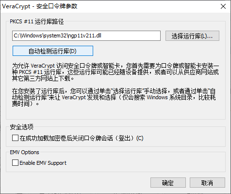
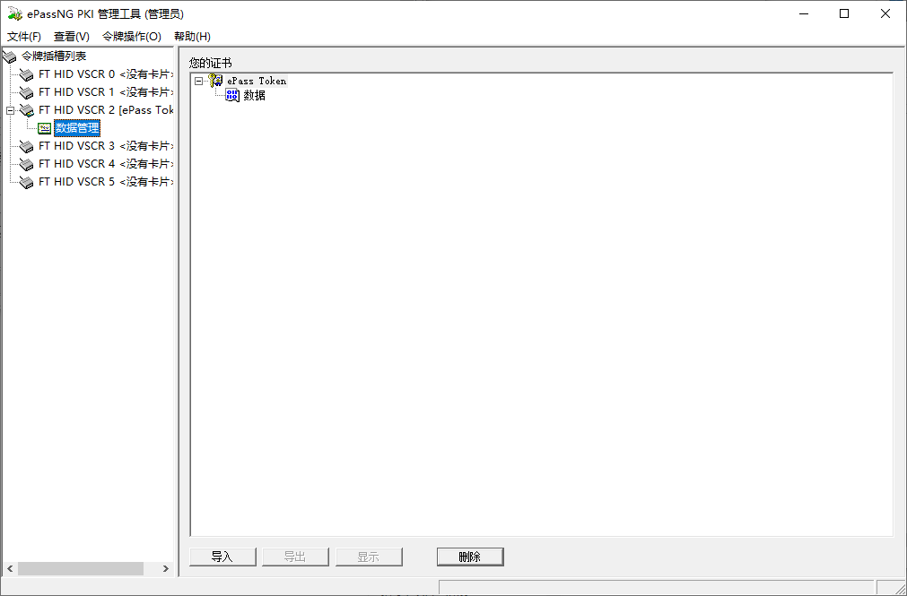
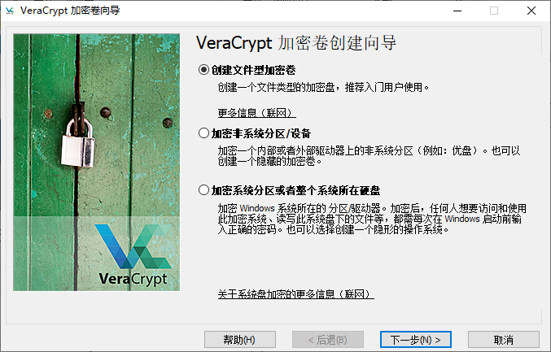
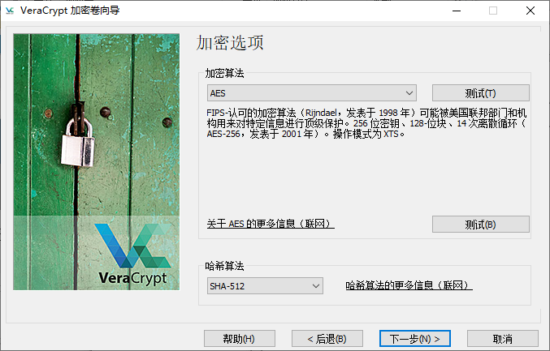
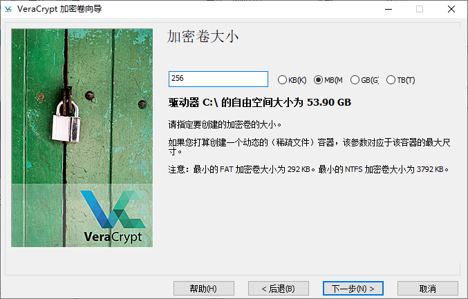
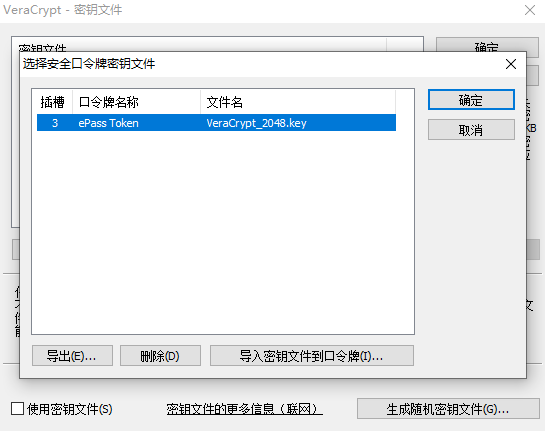
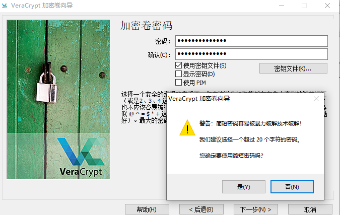
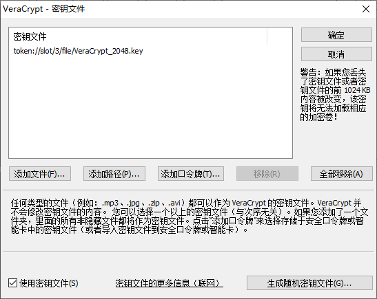
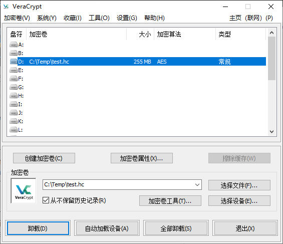
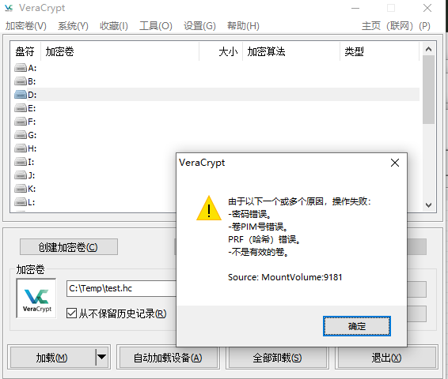

# ePass1000ND
前几天在做淘宝看广告任务的时候发现，飞天诚信ePass1000ND提供标准安全中间件CSP接口，提供标准安全中间件PKCS#11接口，支持多个密钥的存储，最高可存储6对密钥；硬件实现数字签名，支持X.509 v3标准证书格式，能与多种PKI应用无缝集成等等功能。并且这东西几十元一枚，应用需求没那么多的情况下比Yubikey实惠多了。

在网上搜了一下，使用这个作为个人应用的例子还是挺少见的，只找到一篇[uKey双向认证https](https://juejin.cn/post/6885609293891141645)可以作为参考的，配套工具只有某收费站点有下载，而且也不知道是不是完整，于是找了一个贵一点但是提供SDK的商家买了一枚。

**PS:** Yubikey相关使用记录看[这里](https://github.com/awardat/YubiKey-Guide_CHS)

## 选购

我选择的是飞天诚信 ePass1000ND 3.0版本，应该也是现在的最新版本。理论上说更早的版本也可以用，但是对于这种无法升级固件的设备来说还是尽量使用新版本为上。

理论上 ePass系列的其他产品也可以实现相同效果。

从飞天日本官网找到一个[产品对比表](https://ftsafe.co.jp/products/epass_n/epass_compare/)搬过来。

| 機能 | ePass1000ND                                                  | ePass2003      | ePass3003      | ePass3003Auto   |
| ---- | ------------------------------------------------------------ | -------------- | -------------- | --------------- |
| 存储空间（字节）                              | 32K             | 64K            | 64K             | 64K           |
| 存储类型                                                 | EEPROM          | 16位IC卡 | 32位IC卡 | 32位IC卡 |
| 身份验证方法                                               | PIN | PIN | PIN | PIN |
| 存储证书                                             | ○               | ○ | ○ | ○ |
| 私有API Web认证                                 | ○               | ×              | ×               | ×               |
| Windows  (32bit)                 | ○               | ○ | ○ | ○ |
| Windows  (64bit) | ○               | ○ | ○ | ○ |
| Linux                                                        | ×              | ○              | ○               | ○               |
| MacOS（10.6以上）                                            | ×               | ○ | ○COS V6.1以上     | ○  |
| PKCS#11、Microsoft CAPI、X.509 v3 CertificateStorage、SSL v3、IPSec/IKE | ○               | ○ | ○ | ○ |
| ISO 7816-3 、 4                                         | –               | ○              | ○               | ○               |
| PC/SC規格                                                    | ×               | ○              | ×               | ×               |
| 驱动                                                     | 不要            | 不要           | 不要            | 不要            |
| 中间件                                                 | ○               | ○ | ○ | ○ |

从对比表中可以看到ePass1000ND并不支持标准智能卡，所以也不支持某些需要标准智能卡实现的功能，比如无法用于保存BitLocker证书等。

根据日本官网提供的信息，[ePass2003](https://ftsafe.co.jp/products/epass_n/epass2003/)似乎更适合个人使用，功能完整，价格也比较适中.

## 安装软件

ePass1000ND为免驱动版本，无需专门安装驱动，插入系统后会被识别为USB输入设备。但是此时是不能使用的，还需要安装中间件提供标准接口和状态显示。

在将设备插入USB接口后操作系统会自动作为HID设备安装驱动，在设备管理器中可见位于人机接口设备\USB输入设备，使用AIDA64可见HID Token M32.

此时是不能对设备进行操作的，还需要安装中间件实现与设备的通信，运行eps1knd_stdSimpChinese.exe安装中间件，一路下一步完成就可以了。

同时在系统通知栏会多出一个ePassNG证书管理工具的图标，双击弹出主窗口

证书管理工具中显示了当前令牌和其中安装的证书，可以显示证书信息，如果是新的或者初始化过的令牌则证书栏为空。

**首次初始化**

如果插入令牌后，证书管理工具提示”KEY已插入“，但是在选择令牌的地方却是空白的，表示令牌尚未进行过初始化，需要运行PKIInit_M32.exe对令牌进行首次初始化。

根据提示按回车初始化令牌，在初始化时证书管理工具会快速的弹出令牌初始化过程的提示，直到提示初始化完成后按ESC退出初始化程序，初始化完成会创建默认SOPIN和USERPIN，重试次数为15次。

| 账号    | 口令   |
| ------- | ------ |
| SOPIN   | rockey |
| USERPIN | 1234   |

**注：** 此工具仅可对首次使用的新令牌进行初始化（我将其称为首次初始化），已经进行过首次初始化的令牌需要使用下述管理工具进行初始化进行复位。

进行过初始化后即可使用ePassNG PKI 管理工具（管理员）查看和管理令牌

在此界面上可以看到令牌信息和管理功能，还有一个用户版管理软件，主要少了最下行三个按钮的功能。

点击初始化进行令牌初始化界面，输入SOPIN，新的USERPIN进行初始化，如果不知道SOPIN则无法进行初始化。

> USERPIN支持大小写字母、数字和符号

点击登录输入USERPIN后即可查看和管理令牌中保存的数据。

可以在此界面导入PFX、P12、P7B、X509格式证书，查看已有的证书信息，导出公钥和证书，删除证书。

## 获取GDCA免费邮件签名证书

选择这个证书主要有几个个原因，一是免费；二是相比自签证书，CA签发的证书在使用的时候不会有报错；三是虽然该证书在CA公布的证书类别是`基础邮件证书`，但是该证书密钥用法包括`数字签名、密钥加密、数据加密`，增强型密钥用法包括`客户端身份验证、电子邮件保护`，也可以直接用于签名、加密等用途。

打开[SSL证书,HTTPS证书,代码签名证书-数安时代-数字证书电子商城 (trustauth.cn)](https://certmall.trustauth.cn/Home/Login/login.html)

点击右上角注册/登录，进入个人中心

找到免费证书-GDCA安全邮件证书，点击免费申请

输入邮箱，点击发送验证邮件后会收到一封来自**autovalidation@trustauth.cn**的标题为`GDCA电子邮件验证码, YYYY-MM-DD HH:MM:SS`的邮件，将其中的验证码填入以上表单，设置一个强壮的口令，填入手机号和随机码，勾选用户协议后提交申请即可。

> 请选择一个**可靠**的方式保存口令，在导入证书时需要使用到。
>
> 如果是没有验证过的手机号需要发送手机验证码进行验证，手机号应该是实名认证用的，不会体现在证书中。
>
> 似乎Gmail收不到验证邮件。

跳转到下个页面就可以下载证书了，下载得到一个zip文件，其中包含了一个pfx文件和一个[安装说明页面](https://www.trustauth.cn/gdca-ccpb)的快捷方式，导入windows和用作邮件签名的话直接按说明操作即可。

>证书只能下载一次，如果下载的证书文件丢了就只能重新申请了。

证书有效期自申请之时刻起**一年**，到期直接再申请一个即可。

该证书的持有人信息**只包括申请时使用的邮箱地址**，如果需要包含更多信息则只能购买收费产品了。

## 向令牌中导入证书

打开ePassNG PKI 管理工具（管理员）并进行用户登录

登录后会自动跳转到数据管理界面

点击导入，在弹出窗口中选择数字证书并输入证书密码

点击确定后开始执行导入过程，驻留的证书管理工具会在状态栏弹出“正在生成私钥…”、”生成私钥成功“、“正在生成公钥…”、“生成公钥成功”、“正在产生X509证书…”、“产生X509证书”等提示。

同时操作系统会提示导入GDCA根证书的确认信息，点击是确认。

此时在数据管理界面中即可看到刚才安装了一个用户证书、一个机构根证书和一个机构颁发者证书，同时这些证书也可以在Windows的证书管理器中查看。

如果有多个证书，重复以上过程导入，因为机构证书已经导入，在提示有重复证书的时候点两次否即可。

导入完成后个人证书只存在于令牌中，两个签发机构证书会同时存在于Windows和令牌中，可以把令牌中的两个删了省点空间。当把不包含签发机构证书的令牌插入未安装过签发机构证书的电脑中时，Windows会根据个人证书中的参数自动下载安装签发机构证书。

证书的zip文件可以复制到质量可靠的存储卡或U盘等介质中离线保存。

## 使用令牌保存VeraCrypt密钥

[VeraCrypt](https://veracrypt.fr/en/Home.html)是一个基于TrueCrypt 7.1a的开源多平台磁盘加密软件，可以对系统盘（分区）、非系统盘（分区）、文件型加密卷进行加密，支持使用密钥文件和/或口令对加密卷进行保护。

VeraCrypt支持使用一个、多个或一个路径下的全部任意类型的文件作为密钥文件，并从这个（些）文件派生出加密密钥，其原理见[此处](https://veracrypt.fr/en/Keyfiles.html)。也可以使用VeraCrypt自带的密钥文件生成器生成密钥。

密钥文件可以保存在文件系统中也可以保存在符合PKCS #11（2.0或更高版本）标准的安全令牌或智能卡上。这意味着我们可以使用多个令牌分别保存同一个加密卷的多个密钥文件以实现更高的安全性或者多人共管。

### 生成密钥文件并装入令牌

在VeraCrypt的设置菜单中找到“安全口令牌”，打开安全口令牌参数设置。

在此设置口令牌的PKCS #11运行库路径，安装好中间件后点击“自动检测运行库”即可自动加载运行库路径。

> 因为只能加载一个运行库文件，所以使用多令牌时需要使用相同的令牌。

在工具菜单中找到“密钥文件生成器”。

在打开的窗口中尽可能地移动鼠标直到进度条移动到最后，然后选择密钥文件大小和文件名保存密钥文件。密钥文件的内容由VC自带的[随机数生成器](https://veracrypt.fr/en/Random%20Number%20Generator.html)产生。

在工具菜单中找到“管理安全口令牌密钥文件”，如果令牌已插入并且被正确识别，此时会弹出令牌USERPIN输入框，输入先前设置好的PIN继续。

打开后会显示令牌中已装入的密钥文件，点击“导入密钥文件到口令牌”，在弹出窗口中选择先前生成的密钥文件，并在选择文件后选择要装入的令牌。在成功装入后会显示当前令牌中保存的密钥文件列表。

此时打开令牌管理软件并登录后即可看到导入的密钥文件。

选择“数据”后点击“显示”即可查看密钥文件信息。

现在密钥文件已经装入令牌，可以开始创建加密卷了。

### 创建加密卷

在VC初始界面点击“创建加密卷”打开“加密卷向导”。

作为示例，我们创建一个文件型加密卷。

选择创建标准加密卷。“[隐藏的加密卷](https://veracrypt.fr/en/Hidden%20Volume.html)”是一个二重加密卷，在一个加密卷中创建了另一个加密卷，并且内外两个加密卷设置不同的口令和密钥，即使挂载了外部卷，也**不可能** 证明其中是否有隐藏卷，因为创建卷时，任何加密卷上的剩余空间总是充满随机数据，并且（未挂载）隐藏卷的任何部分都无法与随机数据区分开来。

> 扩展名不是必须的，此处加上扩展名方便展示。

选择“从不保留历史记录”，这样每次加载加密卷文件、分区或磁盘时都需要手工选择，以防加密卷文件、分区或磁盘被定位而遭受可能的破坏。

默认算法适合大多数情况。

选择一个卷的大小。

设置一个密码，设置一个自己能记住的最长的密码，或者使用可靠的密码管理器保存密码。

勾选“使用密钥文件”，然后点击“密钥文件”按钮打开密钥文件管理面板。

点击“添加口令牌”，输入令牌的USERPIN后选择刚才导入的密钥文件。

点击确定后可见已选择密钥文件。

此时还可以添加文件、路径或者另一个令牌，添加完成后密钥文件列表中会显示添加的全部文件和路径（路径内的文件名不显示），这些密钥文件将共同用于派生加密密钥，所以当选择多个文件时要确保文件一直可用且前1024KB不会被编辑，一旦密钥文件不完整或者产生了变化，加密卷将无法再次打开。密钥文件配置完成后点击确定回到向导。

在点击下一步时会弹出口令长度不足的警告，20位的密码我记不住啦。。。就酱

选择文件系统格式等信息后保持在窗口内移动鼠标，直到随机性进度条走早最后，然后点击“格式化”等待格式化完成。在格式化完成后会弹出确认窗口，点击确认后回到向导，如果需要继续创建加密卷点下一步回到向导开始，如果不需要创建更多的加密卷直接点退出即可。

### 挂载加密卷

在盘符列表选择任意一个空闲盘符，点击“选择文件”选择刚才创建的加密卷文件。

点击“加载”，并在输入密码界面输入创建时设置的密码，勾选“使用密钥文件”后点击“密钥文件”选择所需的密钥文件。

选择完成后点击“确认”挂载加密卷。

> 如果密钥文件清单中有本加密卷未使用的密钥文件需要点击“移除”去除，否则会影响加密密钥的派生。

此时即可在资源管理器中访问加密卷。

**注意：** 在使用完加密卷之后需要点击“卸载”以卸载加密卷，如果加密卷被占用可以等一会再尝试，未正确卸载可能会损坏加密卷。

当挂载加密卷时看到此提示，请检查是否所选或少选密钥文件。

