## 使用令牌保存VeraCrypt密钥

[VeraCrypt](https://veracrypt.fr/en/Home.html)是一个基于TrueCrypt 7.1a的开源多平台磁盘加密软件，可以对系统盘（分区）、非系统盘（分区）、文件型加密卷进行加密，支持使用密钥文件和/或口令对加密卷进行保护。

VeraCrypt支持使用一个、多个或一个路径下的全部任意类型的文件作为密钥文件，并从这个（些）文件派生出加密密钥，其原理见[此处](https://veracrypt.fr/en/Keyfiles.html)。也可以使用VeraCrypt自带的密钥文件生成器生成密钥。

密钥文件可以保存在文件系统中也可以保存在符合PKCS #11（2.0或更高版本）标准的安全令牌或智能卡上。这意味着我们可以使用多个令牌分别保存同一个加密卷的多个密钥文件以实现更高的安全性或者多人共管。

### 生成密钥文件并装入令牌

在VeraCrypt的设置菜单中找到“安全口令牌”，打开安全口令牌参数设置。

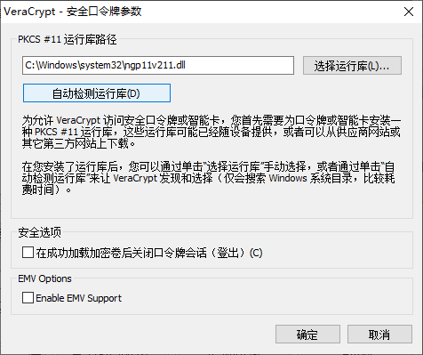

在此设置口令牌的PKCS #11运行库路径，安装好中间件后点击“自动检测运行库”即可自动加载运行库路径。

> 因为只能加载一个运行库文件，所以使用多令牌时需要使用相同的令牌。

在工具菜单中找到“密钥文件生成器”。

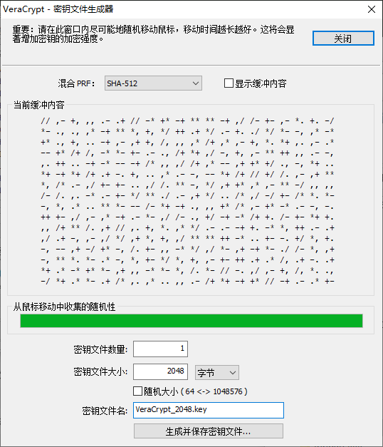

在打开的窗口中尽可能地移动鼠标直到进度条移动到最后，然后选择密钥文件大小和文件名保存密钥文件。密钥文件的内容由VC自带的[随机数生成器](https://veracrypt.fr/en/Random%20Number%20Generator.html)产生。

在工具菜单中找到“管理安全口令牌密钥文件”，如果令牌已插入并且被正确识别，此时会弹出令牌USERPIN输入框，输入先前设置好的PIN继续。

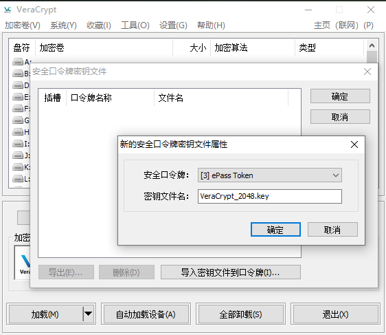

打开后会显示令牌中已装入的密钥文件，点击“导入密钥文件到口令牌”，在弹出窗口中选择先前生成的密钥文件，并在选择文件后选择要装入的令牌。在成功装入后会显示当前令牌中保存的密钥文件列表。

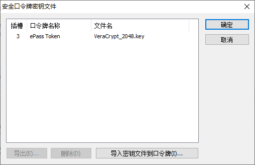

此时打开令牌管理软件并登录后即可看到导入的密钥文件。

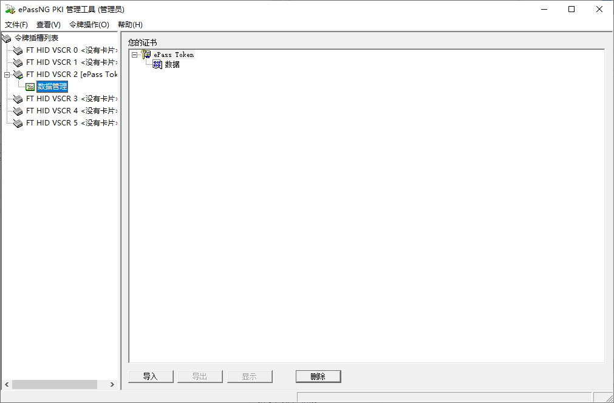

选择“数据”后点击“显示”即可查看密钥文件信息。

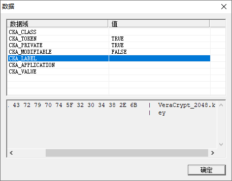

现在密钥文件已经装入令牌，可以开始创建加密卷了。

### 创建加密卷

在VC初始界面点击“创建加密卷”打开“加密卷向导”。

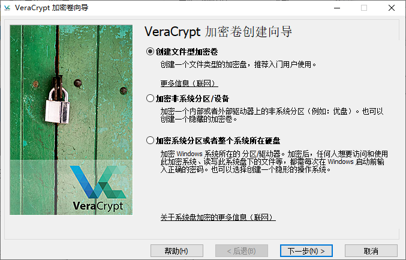

作为示例，我们创建一个文件型加密卷。

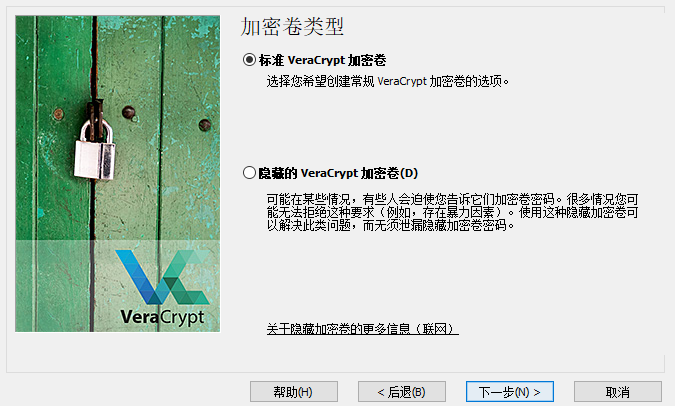

选择创建标准加密卷。“[隐藏的加密卷](https://veracrypt.fr/en/Hidden%20Volume.html)”是一个二重加密卷，在一个加密卷中创建了另一个加密卷，并且内外两个加密卷设置不同的口令和密钥，即使挂载了外部卷，也**不可能** 证明其中是否有隐藏卷，因为创建卷时，任何加密卷上的剩余空间总是充满随机数据，并且（未挂载）隐藏卷的任何部分都无法与随机数据区分开来。

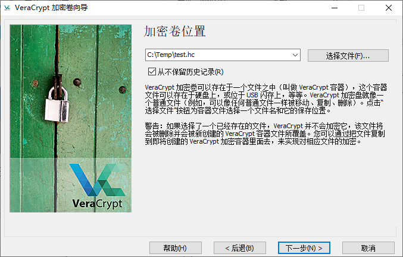

> 扩展名不是必须的，此处加上扩展名方便展示。

选择“从不保留历史记录”，这样每次加载加密卷文件、分区或磁盘时都需要手工选择，以防加密卷文件、分区或磁盘被定位而遭受可能的破坏。

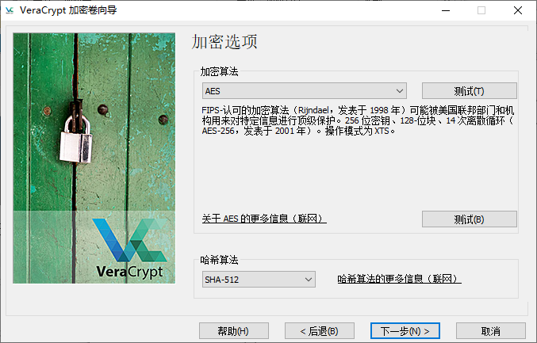

默认算法适合大多数情况。

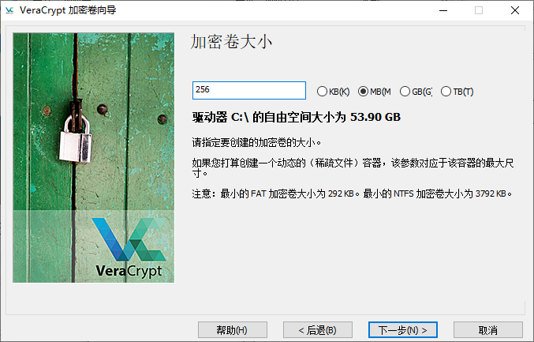

选择一个卷的大小。

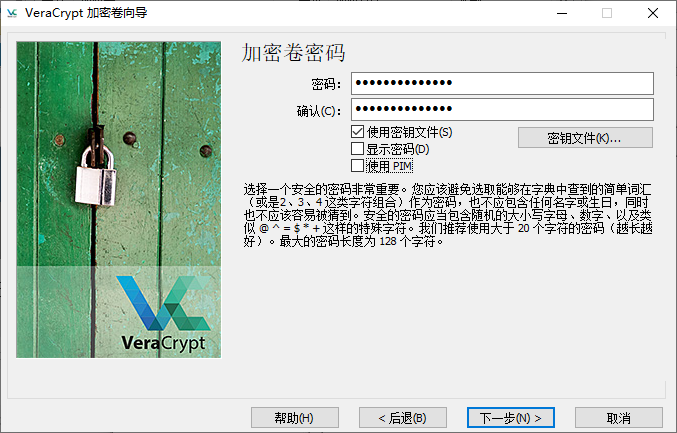

设置一个密码，设置一个自己能记住的最长的密码，或者使用可靠的密码管理器保存密码。

勾选“使用密钥文件”，然后点击“密钥文件”按钮打开密钥文件管理面板。

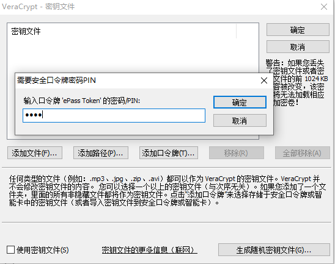

点击“添加口令牌”，输入令牌的USERPIN后选择刚才导入的密钥文件。

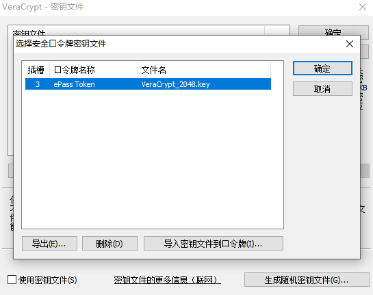

点击确定后可见已选择密钥文件。

此时还可以添加文件、路径或者另一个令牌，添加完成后密钥文件列表中会显示添加的全部文件和路径（路径内的文件名不显示），这些密钥文件将共同用于派生加密密钥，所以当选择多个文件时要确保文件一直可用且前1024KB不会被编辑，一旦密钥文件不完整或者产生了变化，加密卷将无法再次打开。密钥文件配置完成后点击确定回到向导。

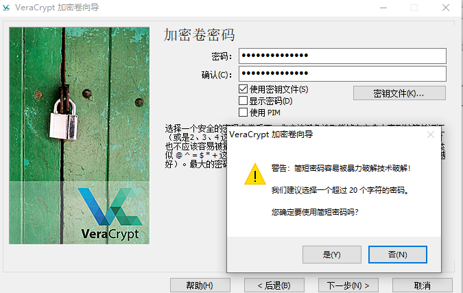

在点击下一步时会弹出口令长度不足的警告，20位的密码我记不住啦。。。就酱

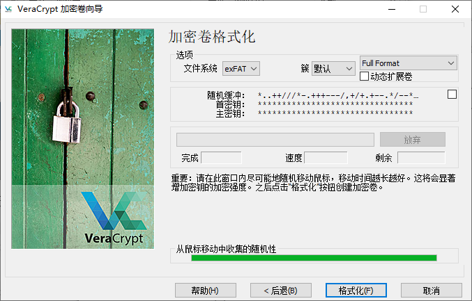

选择文件系统格式等信息后保持在窗口内移动鼠标，直到随机性进度条走早最后，然后点击“格式化”等待格式化完成。在格式化完成后会弹出确认窗口，点击确认后回到向导，如果需要继续创建加密卷点下一步回到向导开始，如果不需要创建更多的加密卷直接点退出即可。

### 挂载加密卷

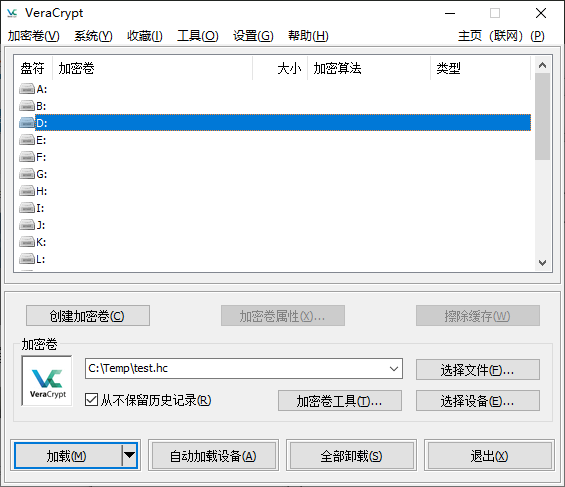

在盘符列表选择任意一个空闲盘符，点击“选择文件”选择刚才创建的加密卷文件。

点击“加载”，并在输入密码界面输入创建时设置的密码，勾选“使用密钥文件”后点击“密钥文件”选择所需的密钥文件。

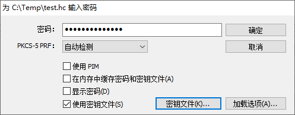

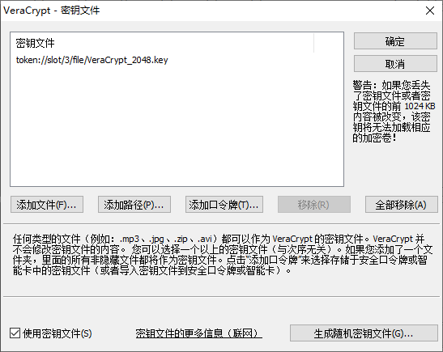

选择完成后点击“确认”挂载加密卷。

> 如果密钥文件清单中有本加密卷未使用的密钥文件需要点击“移除”去除，否则会影响加密密钥的派生。

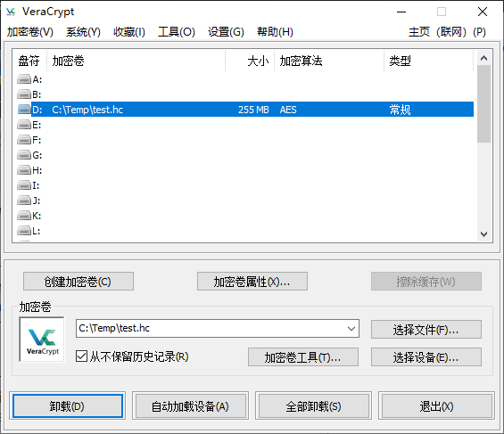

此时即可在资源管理器中访问加密卷。

**注意：** 在使用完加密卷之后需要点击“卸载”以卸载加密卷，如果加密卷被占用可以等一会再尝试，未正确卸载可能会损坏加密卷。

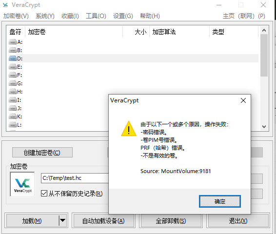

当挂载加密卷时看到此提示，请检查是否所选或少选密钥文件。