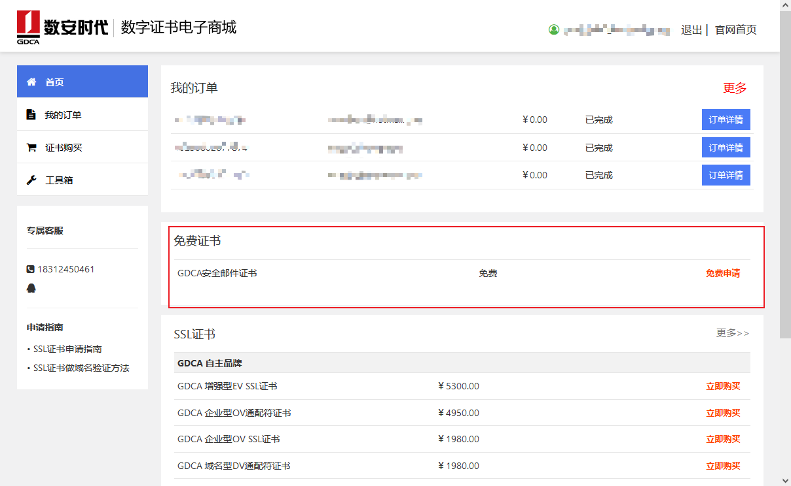
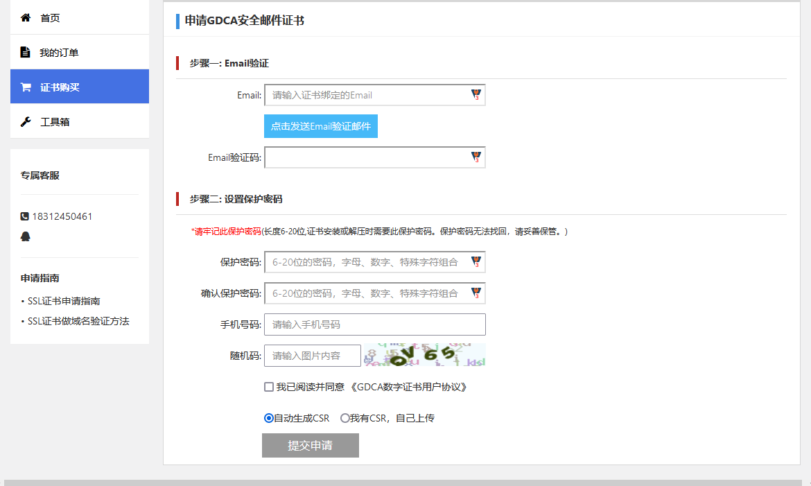
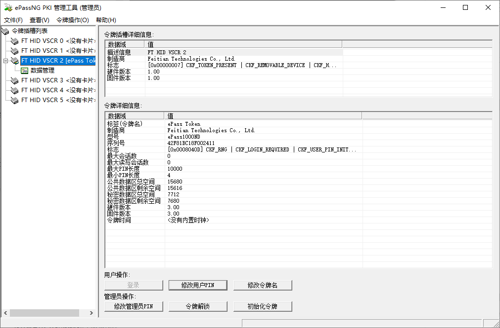
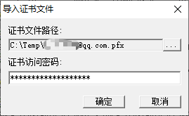
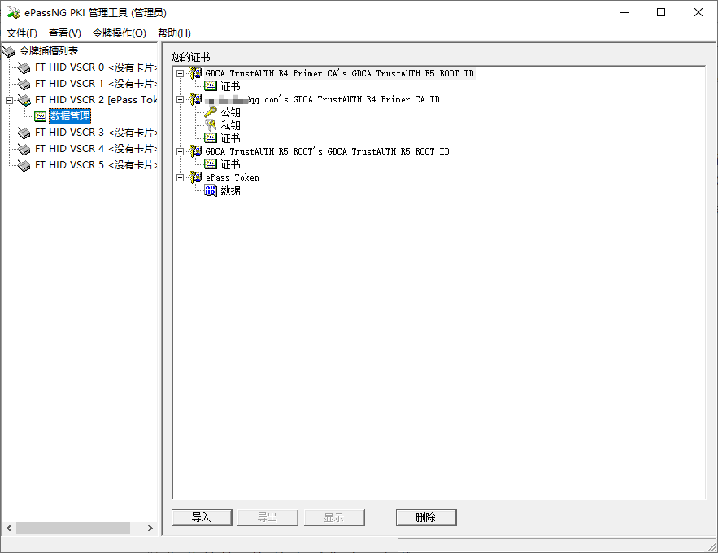

## 获取GDCA免费邮件签名证书

选择这个证书主要有几个个原因，一是免费；二是相比自签证书，CA签发的证书在使用的时候不会有报错；三是虽然该证书在CA公布的证书类别是`基础邮件证书`，但是该证书密钥用法包括`数字签名、密钥加密、数据加密`，增强型密钥用法包括`客户端身份验证、电子邮件保护`，也可以直接用于签名、加密等用途。

打开[SSL证书,HTTPS证书,代码签名证书-数安时代-数字证书电子商城 (trustauth.cn)](https://certmall.trustauth.cn/Home/Login/login.html)

点击右上角注册/登录，进入个人中心

找到免费证书-GDCA安全邮件证书，点击免费申请

输入邮箱，点击发送验证邮件后会收到一封来自**autovalidation@trustauth.cn**的标题为`GDCA电子邮件验证码, YYYY-MM-DD HH:MM:SS`的邮件，将其中的验证码填入以上表单，设置一个强壮的口令，填入手机号和随机码，勾选用户协议后提交申请即可。

> 请选择一个**可靠**的方式保存口令，在导入证书时需要使用到。
>
> 如果是没有验证过的手机号需要发送手机验证码进行验证，手机号应该是实名认证用的，不会体现在证书中。
>
> 似乎Gmail收不到验证邮件。

跳转到下个页面就可以下载证书了，下载得到一个zip文件，其中包含了一个pfx文件和一个[安装说明页面](https://www.trustauth.cn/gdca-ccpb)的快捷方式，导入windows和用作邮件签名的话直接按说明操作即可。

>证书只能下载一次，如果下载的证书文件丢了就只能重新申请了。

证书有效期自申请之时刻起**一年**，到期直接再申请一个即可。

该证书的持有人信息**只包括申请时使用的邮箱地址**，如果需要包含更多信息则只能购买收费产品了。

## 向令牌中导入证书

打开ePassNG PKI 管理工具（管理员）并进行用户登录

登录后会自动跳转到数据管理界面

点击导入，在弹出窗口中选择数字证书并输入证书密码

点击确定后开始执行导入过程，驻留的证书管理工具会在状态栏弹出“正在生成私钥…”、”生成私钥成功“、“正在生成公钥…”、“生成公钥成功”、“正在产生X509证书…”、“产生X509证书”等提示。

同时操作系统会提示导入GDCA根证书的确认信息，点击是确认。

此时在数据管理界面中即可看到刚才安装了一个用户证书、一个机构根证书和一个机构颁发者证书，同时这些证书也可以在Windows的证书管理器中查看。

如果有多个证书，重复以上过程导入，因为机构证书已经导入，在提示有重复证书的时候点两次否即可。

导入完成后个人证书只存在于令牌中，两个签发机构证书会同时存在于Windows和令牌中，可以把令牌中的两个删了省点空间。当把不包含签发机构证书的令牌插入未安装过签发机构证书的电脑中时，Windows会根据个人证书中的参数自动下载安装签发机构证书。

证书的zip文件可以复制到质量可靠的存储卡或U盘等介质中离线保存。